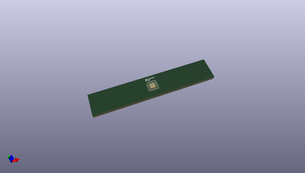
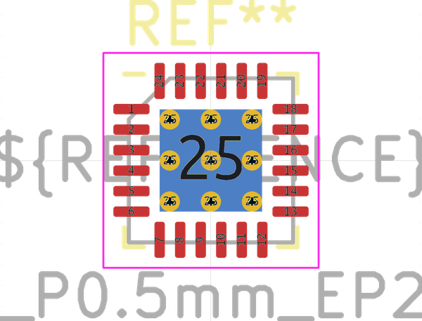
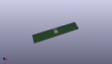

# OOMP Footprint  
## VQFN-24-1EP_4x4mm_P0.5mm_EP2.5x2.5mm_ThermalVias  by none  
  
oomp key: oomp_kicad_package_dfn_qfn_vqfn_24_1ep_4x4mm_p0_5mm_ep2_5x2_5mm_thermalvias  
  
source repo at: [http://gitlab.com/kicad/kicad-footprints/blob/master/tmp/data//oomlout_oomp_footprint_src/Varistor.pretty/RV_Rect_V25S440P_L26.5mm_W8.2mm_P12.7mm.kicad_mod](http://gitlab.com/kicad/kicad-footprints/blob/master/tmp/data//oomlout_oomp_footprint_src/Varistor.pretty/RV_Rect_V25S440P_L26.5mm_W8.2mm_P12.7mm.kicad_mod)  
## Footprint  
  
  
  
  
| name | value | 
| --- | --- | 
| footprint name | VQFN-24-1EP_4x4mm_P0.5mm_EP2.5x2.5mm_ThermalVias | 
| footprint description | VQFN, 24 Pin (https://ww1.microchip.com/downloads/aemDocuments/documents/product-documents/package-drawings/24L-VQFN%E2%80%934x4x0.9mm-MJ-C04-00143b.pdf), generated with kicad-footprint-generator ipc_noLead_generator.py | 
| number of pads | 39 | 
| github path | http://github.com/kicad/kicad-footprints/blob/master/tmp/data//oomlout_oomp_footprint_src/Package_DFN_QFN.pretty/VQFN-24-1EP_4x4mm_P0.5mm_EP2.5x2.5mm_ThermalVias.kicad_mod | 
| oomp key | oomp_kicad_package_dfn_qfn_vqfn_24_1ep_4x4mm_p0_5mm_ep2_5x2_5mm_thermalvias | 
| oomp bot github | https://github.com/oomlout/oomlout_oomp_footprint_bot/tree/main/tmp/data//oomlout_oomp_footprint_src/footprints/kicad_package_dfn_qfn_vqfn_24_1ep_4x4mm_p0_5mm_ep2_5x2_5mm_thermalvias/working | 
## Images  
  
  
  
  
  
  
  
  
