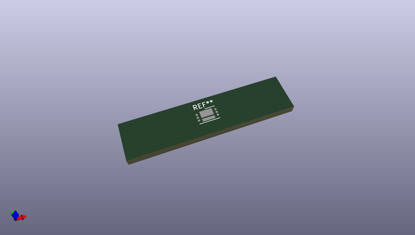
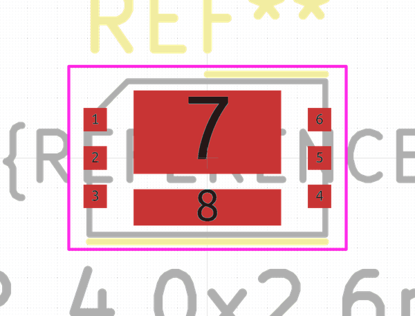
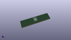

# OOMP Footprint  
## WDFN-6-2EP_4.0x2.6mm_P0.65mm  by none  
  
oomp key: oomp_kicad_package_dfn_qfn_wdfn_6_2ep_4_0x2_6mm_p0_65mm  
  
source repo at: [http://gitlab.com/kicad/kicad-footprints/blob/master/tmp/data//oomlout_oomp_footprint_src/Varistor.pretty/RV_Rect_V25S440P_L26.5mm_W8.2mm_P12.7mm.kicad_mod](http://gitlab.com/kicad/kicad-footprints/blob/master/tmp/data//oomlout_oomp_footprint_src/Varistor.pretty/RV_Rect_V25S440P_L26.5mm_W8.2mm_P12.7mm.kicad_mod)  
## Footprint  
  
  
  
  
| name | value | 
| --- | --- | 
| footprint name | WDFN-6-2EP_4.0x2.6mm_P0.65mm | 
| footprint description | WDFN, 6 pin, 4.0x2.6, 0.65P; Two exposed pads, (https://www.onsemi.com/pub/Collateral/511BZ.PDF) | 
| number of pads | 8 | 
| github path | http://github.com/kicad/kicad-footprints/blob/master/tmp/data//oomlout_oomp_footprint_src/Package_DFN_QFN.pretty/WDFN-6-2EP_4.0x2.6mm_P0.65mm.kicad_mod | 
| oomp key | oomp_kicad_package_dfn_qfn_wdfn_6_2ep_4_0x2_6mm_p0_65mm | 
| oomp bot github | https://github.com/oomlout/oomlout_oomp_footprint_bot/tree/main/tmp/data//oomlout_oomp_footprint_src/footprints/kicad_package_dfn_qfn_wdfn_6_2ep_4_0x2_6mm_p0_65mm/working | 
## Images  
  
  
  
  
  
  
  
  
