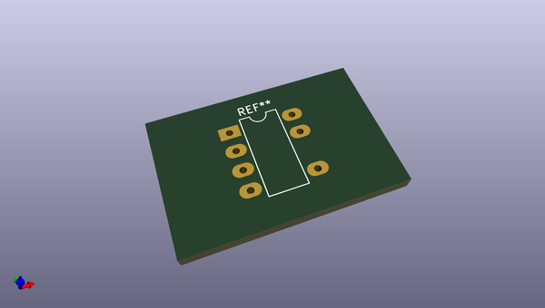
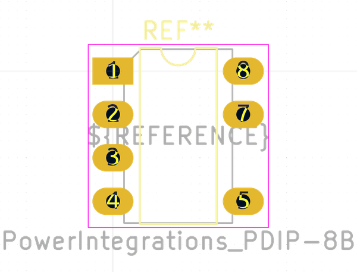
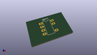
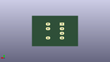
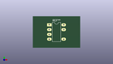

# OOMP Footprint  
## PowerIntegrations_PDIP-8B  by none  
  
oomp key: oomp_kicad_package_dip_powerintegrations_pdip_8b  
  
source repo at: [http://gitlab.com/kicad/kicad-footprints/blob/master/tmp/data//oomlout_oomp_footprint_src/Varistor.pretty/RV_Rect_V25S440P_L26.5mm_W8.2mm_P12.7mm.kicad_mod](http://gitlab.com/kicad/kicad-footprints/blob/master/tmp/data//oomlout_oomp_footprint_src/Varistor.pretty/RV_Rect_V25S440P_L26.5mm_W8.2mm_P12.7mm.kicad_mod)  
## Footprint  
  
  
  
  
| name | value | 
| --- | --- | 
| footprint name | PowerIntegrations_PDIP-8B | 
| footprint description | Power Integrations variant of 8-lead though-hole mounted DIP package, row spacing 7.62 mm (300 mils), LongPads, see https://www.power.com/sites/default/files/product-docs/lnk520.pdf | 
| number of pads | 7 | 
| github path | http://github.com/kicad/kicad-footprints/blob/master/tmp/data//oomlout_oomp_footprint_src/Package_DIP.pretty/PowerIntegrations_PDIP-8B.kicad_mod | 
| oomp key | oomp_kicad_package_dip_powerintegrations_pdip_8b | 
| oomp bot github | https://github.com/oomlout/oomlout_oomp_footprint_bot/tree/main/tmp/data//oomlout_oomp_footprint_src/footprints/kicad_package_dip_powerintegrations_pdip_8b/working | 
## Images  
  
  
  
  
  
  
  
  
