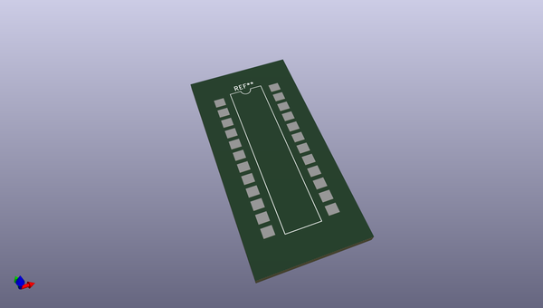
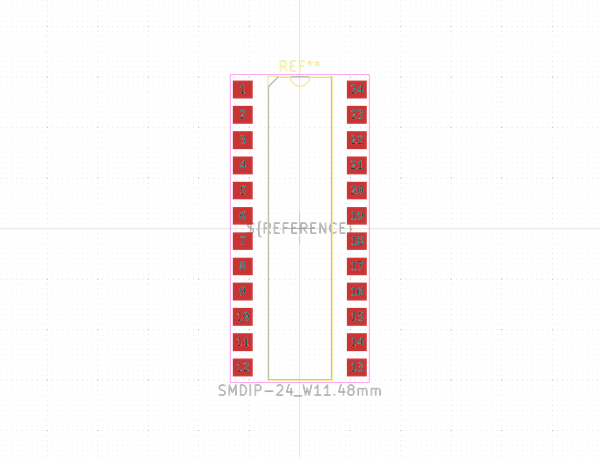
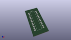
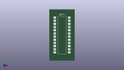

# OOMP Footprint  
## SMDIP-24_W11.48mm  by none  
  
oomp key: oomp_kicad_package_dip_smdip_24_w11_48mm  
  
source repo at: [http://gitlab.com/kicad/kicad-footprints/blob/master/tmp/data//oomlout_oomp_footprint_src/Varistor.pretty/RV_Rect_V25S440P_L26.5mm_W8.2mm_P12.7mm.kicad_mod](http://gitlab.com/kicad/kicad-footprints/blob/master/tmp/data//oomlout_oomp_footprint_src/Varistor.pretty/RV_Rect_V25S440P_L26.5mm_W8.2mm_P12.7mm.kicad_mod)  
## Footprint  
  
  
  
  
| name | value | 
| --- | --- | 
| footprint name | SMDIP-24_W11.48mm | 
| footprint description | 24-lead surface-mounted (SMD) DIP package, row spacing 11.48 mm (451 mils) | 
| number of pads | 24 | 
| github path | http://github.com/kicad/kicad-footprints/blob/master/tmp/data//oomlout_oomp_footprint_src/Package_DIP.pretty/SMDIP-24_W11.48mm.kicad_mod | 
| oomp key | oomp_kicad_package_dip_smdip_24_w11_48mm | 
| oomp bot github | https://github.com/oomlout/oomlout_oomp_footprint_bot/tree/main/tmp/data//oomlout_oomp_footprint_src/footprints/kicad_package_dip_smdip_24_w11_48mm/working | 
## Images  
  
  
  
  
  
  
  
  
