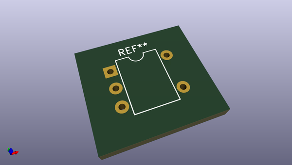
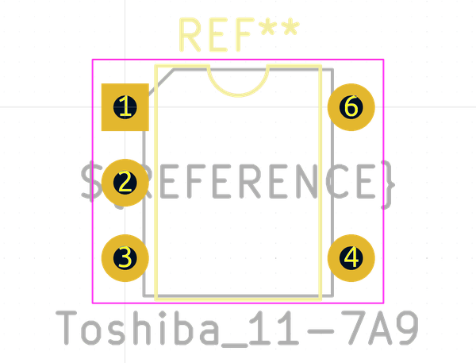
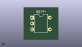

# OOMP Footprint  
## Toshiba_11-7A9  by none  
  
oomp key: oomp_kicad_package_dip_toshiba_11_7a9  
  
source repo at: [http://gitlab.com/kicad/kicad-footprints/blob/master/tmp/data//oomlout_oomp_footprint_src/Varistor.pretty/RV_Rect_V25S440P_L26.5mm_W8.2mm_P12.7mm.kicad_mod](http://gitlab.com/kicad/kicad-footprints/blob/master/tmp/data//oomlout_oomp_footprint_src/Varistor.pretty/RV_Rect_V25S440P_L26.5mm_W8.2mm_P12.7mm.kicad_mod)  
## Footprint  
  
  
  
  
| name | value | 
| --- | --- | 
| footprint name | Toshiba_11-7A9 | 
| footprint description | Toshiba 11-7A9 package, like 6-lead dip package with missing pin 5, row spacing 7.62 mm (300 mils), https://toshiba.semicon-storage.com/info/docget.jsp?did=1421&prodName=TLP3021(S) | 
| number of pads | 5 | 
| github path | http://github.com/kicad/kicad-footprints/blob/master/tmp/data//oomlout_oomp_footprint_src/Package_DIP.pretty/Toshiba_11-7A9.kicad_mod | 
| oomp key | oomp_kicad_package_dip_toshiba_11_7a9 | 
| oomp bot github | https://github.com/oomlout/oomlout_oomp_footprint_bot/tree/main/tmp/data//oomlout_oomp_footprint_src/footprints/kicad_package_dip_toshiba_11_7a9/working | 
## Images  
  
  
  
  
  
  
  
  
