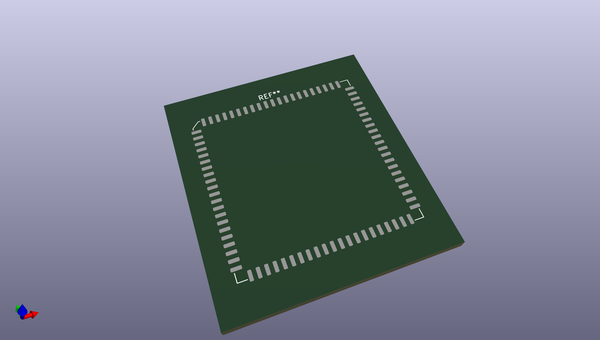
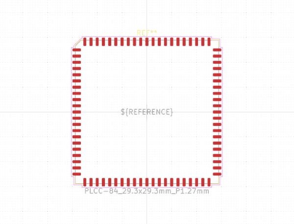
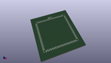

# OOMP Footprint  
## PLCC-84_29.3x29.3mm_P1.27mm  by none  
  
oomp key: oomp_kicad_package_lcc_plcc_84_29_3x29_3mm_p1_27mm  
  
source repo at: [http://gitlab.com/kicad/kicad-footprints/blob/master/tmp/data//oomlout_oomp_footprint_src/Varistor.pretty/RV_Rect_V25S440P_L26.5mm_W8.2mm_P12.7mm.kicad_mod](http://gitlab.com/kicad/kicad-footprints/blob/master/tmp/data//oomlout_oomp_footprint_src/Varistor.pretty/RV_Rect_V25S440P_L26.5mm_W8.2mm_P12.7mm.kicad_mod)  
## Footprint  
  
  
  
  
| name | value | 
| --- | --- | 
| footprint name | PLCC-84_29.3x29.3mm_P1.27mm | 
| footprint description | PLCC, 84 Pin (http://www.microsemi.com/index.php?option=com_docman&task=doc_download&gid=131095), generated with kicad-footprint-generator ipc_plcc_jLead_generator.py | 
| number of pads | 84 | 
| github path | http://github.com/kicad/kicad-footprints/blob/master/tmp/data//oomlout_oomp_footprint_src/Package_LCC.pretty/PLCC-84_29.3x29.3mm_P1.27mm.kicad_mod | 
| oomp key | oomp_kicad_package_lcc_plcc_84_29_3x29_3mm_p1_27mm | 
| oomp bot github | https://github.com/oomlout/oomlout_oomp_footprint_bot/tree/main/tmp/data//oomlout_oomp_footprint_src/footprints/kicad_package_lcc_plcc_84_29_3x29_3mm_p1_27mm/working | 
## Images  
  
  
  
  
  
  
  
  
