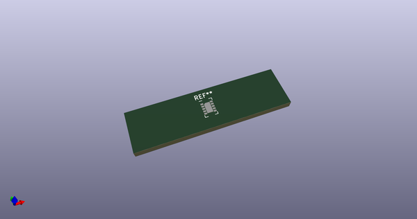
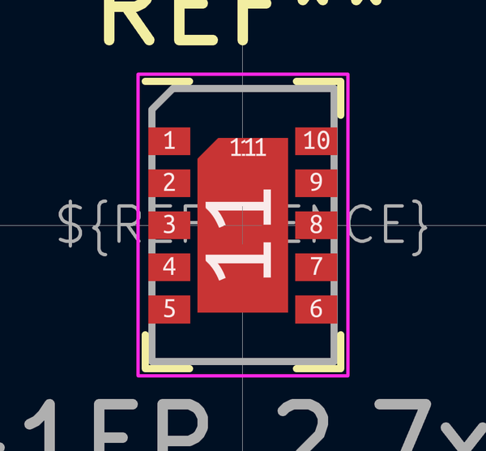

# OOMP Footprint  
## AMS_LGA-10-1EP_2.7x4mm_P0.6mm  by none  
  
oomp key: oomp_kicad_package_lga_ams_lga_10_1ep_2_7x4mm_p0_6mm  
  
source repo at: [http://gitlab.com/kicad/kicad-footprints/blob/master/tmp/data//oomlout_oomp_footprint_src/Varistor.pretty/RV_Rect_V25S440P_L26.5mm_W8.2mm_P12.7mm.kicad_mod](http://gitlab.com/kicad/kicad-footprints/blob/master/tmp/data//oomlout_oomp_footprint_src/Varistor.pretty/RV_Rect_V25S440P_L26.5mm_W8.2mm_P12.7mm.kicad_mod)  
## Footprint  
  
  
  
  
| name | value | 
| --- | --- | 
| footprint name | AMS_LGA-10-1EP_2.7x4mm_P0.6mm | 
| footprint description | LGA-10, http://ams.com/eng/content/download/951091/2269479/471718 | 
| number of pads | 13 | 
| github path | http://github.com/kicad/kicad-footprints/blob/master/tmp/data//oomlout_oomp_footprint_src/Package_LGA.pretty/AMS_LGA-10-1EP_2.7x4mm_P0.6mm.kicad_mod | 
| oomp key | oomp_kicad_package_lga_ams_lga_10_1ep_2_7x4mm_p0_6mm | 
| oomp bot github | https://github.com/oomlout/oomlout_oomp_footprint_bot/tree/main/tmp/data//oomlout_oomp_footprint_src/footprints/kicad_package_lga_ams_lga_10_1ep_2_7x4mm_p0_6mm/working | 
## Images  
  
  
  
  
  
  
  
  
