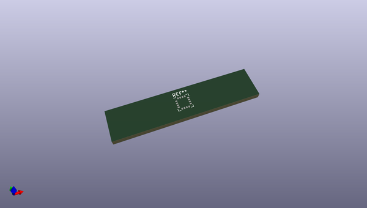
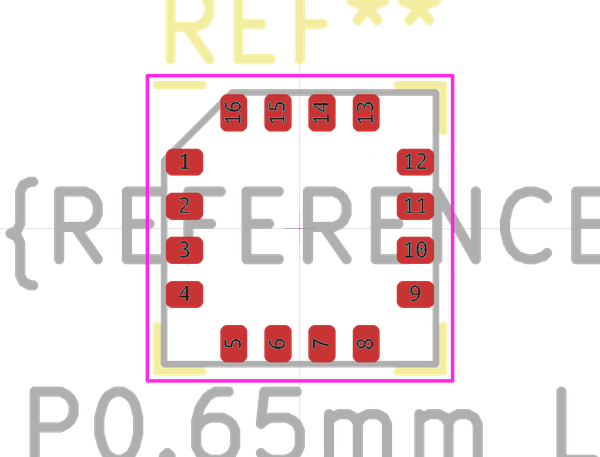
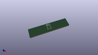

# OOMP Footprint  
## LGA-16_4x4mm_P0.65mm_LayoutBorder4x4y  by none  
  
oomp key: oomp_kicad_package_lga_lga_16_4x4mm_p0_65mm_layoutborder4x4y  
  
source repo at: [http://gitlab.com/kicad/kicad-footprints/blob/master/tmp/data//oomlout_oomp_footprint_src/Varistor.pretty/RV_Rect_V25S440P_L26.5mm_W8.2mm_P12.7mm.kicad_mod](http://gitlab.com/kicad/kicad-footprints/blob/master/tmp/data//oomlout_oomp_footprint_src/Varistor.pretty/RV_Rect_V25S440P_L26.5mm_W8.2mm_P12.7mm.kicad_mod)  
## Footprint  
  
  
  
  
| name | value | 
| --- | --- | 
| footprint name | LGA-16_4x4mm_P0.65mm_LayoutBorder4x4y | 
| footprint description | LGA, 16 Pin (http://www.st.com/resource/en/datasheet/l3gd20.pdf), generated with kicad-footprint-generator ipc_noLead_generator.py | 
| number of pads | 16 | 
| github path | http://github.com/kicad/kicad-footprints/blob/master/tmp/data//oomlout_oomp_footprint_src/Package_LGA.pretty/LGA-16_4x4mm_P0.65mm_LayoutBorder4x4y.kicad_mod | 
| oomp key | oomp_kicad_package_lga_lga_16_4x4mm_p0_65mm_layoutborder4x4y | 
| oomp bot github | https://github.com/oomlout/oomlout_oomp_footprint_bot/tree/main/tmp/data//oomlout_oomp_footprint_src/footprints/kicad_package_lga_lga_16_4x4mm_p0_65mm_layoutborder4x4y/working | 
## Images  
  
  
  
  
  
  
  
  
