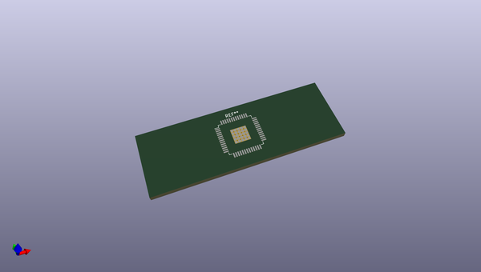
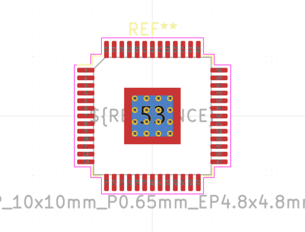

# OOMP Footprint  
## LQFP-52-1EP_10x10mm_P0.65mm_EP4.8x4.8mm_ThermalVias  by none  
  
oomp key: oomp_kicad_package_qfp_lqfp_52_1ep_10x10mm_p0_65mm_ep4_8x4_8mm_thermalvias  
  
source repo at: [http://gitlab.com/kicad/kicad-footprints/blob/master/tmp/data//oomlout_oomp_footprint_src/Varistor.pretty/RV_Rect_V25S440P_L26.5mm_W8.2mm_P12.7mm.kicad_mod](http://gitlab.com/kicad/kicad-footprints/blob/master/tmp/data//oomlout_oomp_footprint_src/Varistor.pretty/RV_Rect_V25S440P_L26.5mm_W8.2mm_P12.7mm.kicad_mod)  
## Footprint  
  
  
  
  
| name | value | 
| --- | --- | 
| footprint name | LQFP-52-1EP_10x10mm_P0.65mm_EP4.8x4.8mm_ThermalVias | 
| footprint description | LQFP, 52 Pin (https://www.onsemi.com/pub/Collateral/848H-01.PDF), generated with kicad-footprint-generator ipc_gullwing_generator.py | 
| number of pads | 95 | 
| github path | http://github.com/kicad/kicad-footprints/blob/master/tmp/data//oomlout_oomp_footprint_src/Package_QFP.pretty/LQFP-52-1EP_10x10mm_P0.65mm_EP4.8x4.8mm_ThermalVias.kicad_mod | 
| oomp key | oomp_kicad_package_qfp_lqfp_52_1ep_10x10mm_p0_65mm_ep4_8x4_8mm_thermalvias | 
| oomp bot github | https://github.com/oomlout/oomlout_oomp_footprint_bot/tree/main/tmp/data//oomlout_oomp_footprint_src/footprints/kicad_package_qfp_lqfp_52_1ep_10x10mm_p0_65mm_ep4_8x4_8mm_thermalvias/working | 
## Images  
  
  
  
  
  
  
  
  
