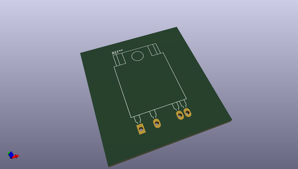
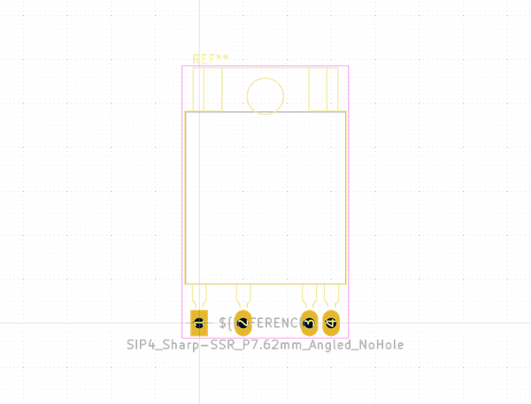
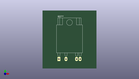

# OOMP Footprint  
## SIP4_Sharp-SSR_P7.62mm_Angled_NoHole  by none  
  
oomp key: oomp_kicad_package_sip_sip4_sharp_ssr_p7_62mm_angled_nohole  
  
source repo at: [http://gitlab.com/kicad/kicad-footprints/blob/master/tmp/data//oomlout_oomp_footprint_src/Varistor.pretty/RV_Rect_V25S440P_L26.5mm_W8.2mm_P12.7mm.kicad_mod](http://gitlab.com/kicad/kicad-footprints/blob/master/tmp/data//oomlout_oomp_footprint_src/Varistor.pretty/RV_Rect_V25S440P_L26.5mm_W8.2mm_P12.7mm.kicad_mod)  
## Footprint  
  
  
  
  
| name | value | 
| --- | --- | 
| footprint name | SIP4_Sharp-SSR_P7.62mm_Angled_NoHole | 
| footprint description | SIP4 Footprint for SSR made by Sharp | 
| number of pads | 4 | 
| github path | http://github.com/kicad/kicad-footprints/blob/master/tmp/data//oomlout_oomp_footprint_src/Package_SIP.pretty/SIP4_Sharp-SSR_P7.62mm_Angled_NoHole.kicad_mod | 
| oomp key | oomp_kicad_package_sip_sip4_sharp_ssr_p7_62mm_angled_nohole | 
| oomp bot github | https://github.com/oomlout/oomlout_oomp_footprint_bot/tree/main/tmp/data//oomlout_oomp_footprint_src/footprints/kicad_package_sip_sip4_sharp_ssr_p7_62mm_angled_nohole/working | 
## Images  
  
  
  
  
  
  
  
  
