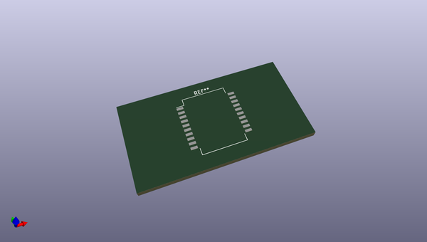
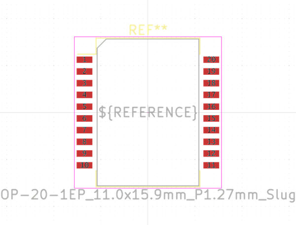
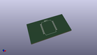

# OOMP Footprint  
## HSOP-20-1EP_11.0x15.9mm_P1.27mm_SlugUp  by none  
  
oomp key: oomp_kicad_package_so_hsop_20_1ep_11_0x15_9mm_p1_27mm_slugup  
  
source repo at: [http://gitlab.com/kicad/kicad-footprints/blob/master/tmp/data//oomlout_oomp_footprint_src/Varistor.pretty/RV_Rect_V25S440P_L26.5mm_W8.2mm_P12.7mm.kicad_mod](http://gitlab.com/kicad/kicad-footprints/blob/master/tmp/data//oomlout_oomp_footprint_src/Varistor.pretty/RV_Rect_V25S440P_L26.5mm_W8.2mm_P12.7mm.kicad_mod)  
## Footprint  
  
  
  
  
| name | value | 
| --- | --- | 
| footprint name | HSOP-20-1EP_11.0x15.9mm_P1.27mm_SlugUp | 
| footprint description | HSOP 11.0x15.9mm Pitch 1.27mm Slug Up (PowerSO-20) [JEDEC MO-166] (http://www.st.com/resource/en/datasheet/tda7266d.pdf, www.st.com/resource/en/application_note/cd00003801.pdf) | 
| number of pads | 20 | 
| github path | http://github.com/kicad/kicad-footprints/blob/master/tmp/data//oomlout_oomp_footprint_src/Package_SO.pretty/HSOP-20-1EP_11.0x15.9mm_P1.27mm_SlugUp.kicad_mod | 
| oomp key | oomp_kicad_package_so_hsop_20_1ep_11_0x15_9mm_p1_27mm_slugup | 
| oomp bot github | https://github.com/oomlout/oomlout_oomp_footprint_bot/tree/main/tmp/data//oomlout_oomp_footprint_src/footprints/kicad_package_so_hsop_20_1ep_11_0x15_9mm_p1_27mm_slugup/working | 
## Images  
  
  
  
  
  
  
  
  
