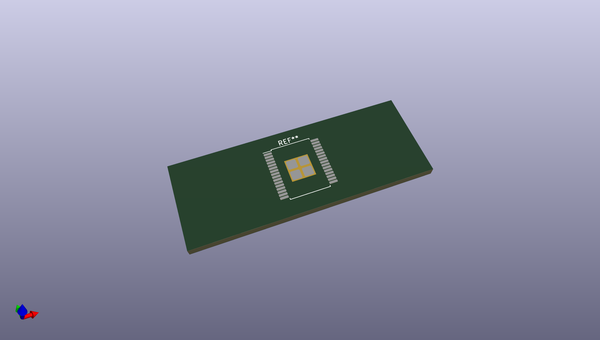
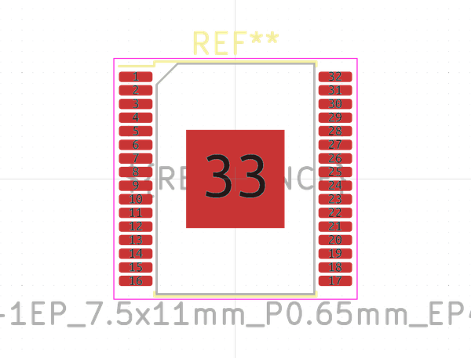

# OOMP Footprint  
## HSOP-32-1EP_7.5x11mm_P0.65mm_EP4.7x4.7mm  by none  
  
oomp key: oomp_kicad_package_so_hsop_32_1ep_7_5x11mm_p0_65mm_ep4_7x4_7mm  
  
source repo at: [http://gitlab.com/kicad/kicad-footprints/blob/master/tmp/data//oomlout_oomp_footprint_src/Varistor.pretty/RV_Rect_V25S440P_L26.5mm_W8.2mm_P12.7mm.kicad_mod](http://gitlab.com/kicad/kicad-footprints/blob/master/tmp/data//oomlout_oomp_footprint_src/Varistor.pretty/RV_Rect_V25S440P_L26.5mm_W8.2mm_P12.7mm.kicad_mod)  
## Footprint  
  
  
  
  
| name | value | 
| --- | --- | 
| footprint name | HSOP-32-1EP_7.5x11mm_P0.65mm_EP4.7x4.7mm | 
| footprint description | HSOP, 32 Pin (https://www.nxp.com/docs/en/package-information/SOT1746-3.pdf), generated with kicad-footprint-generator ipc_gullwing_generator.py | 
| number of pads | 37 | 
| github path | http://github.com/kicad/kicad-footprints/blob/master/tmp/data//oomlout_oomp_footprint_src/Package_SO.pretty/HSOP-32-1EP_7.5x11mm_P0.65mm_EP4.7x4.7mm.kicad_mod | 
| oomp key | oomp_kicad_package_so_hsop_32_1ep_7_5x11mm_p0_65mm_ep4_7x4_7mm | 
| oomp bot github | https://github.com/oomlout/oomlout_oomp_footprint_bot/tree/main/tmp/data//oomlout_oomp_footprint_src/footprints/kicad_package_so_hsop_32_1ep_7_5x11mm_p0_65mm_ep4_7x4_7mm/working | 
## Images  
  
  
  
  
  
  
  
  
