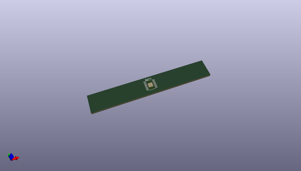
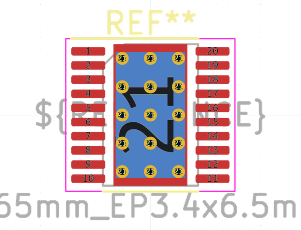
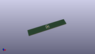

# OOMP Footprint  
## HTSSOP-20-1EP_4.4x6.5mm_P0.65mm_EP3.4x6.5mm_Mask2.96x2.96mm_ThermalVias  by none  
  
oomp key: oomp_kicad_package_so_htssop_20_1ep_4_4x6_5mm_p0_65mm_ep3_4x6_5mm_mask2_96x2_96mm_thermalvias  
  
source repo at: [http://gitlab.com/kicad/kicad-footprints/blob/master/tmp/data//oomlout_oomp_footprint_src/Varistor.pretty/RV_Rect_V25S440P_L26.5mm_W8.2mm_P12.7mm.kicad_mod](http://gitlab.com/kicad/kicad-footprints/blob/master/tmp/data//oomlout_oomp_footprint_src/Varistor.pretty/RV_Rect_V25S440P_L26.5mm_W8.2mm_P12.7mm.kicad_mod)  
## Footprint  
  
  
  
  
| name | value | 
| --- | --- | 
| footprint name | HTSSOP-20-1EP_4.4x6.5mm_P0.65mm_EP3.4x6.5mm_Mask2.96x2.96mm_ThermalVias | 
| footprint description | HTSSOP, 20 Pin (https://www.ti.com/lit/ds/symlink/tps2663.pdf#page=49), generated with kicad-footprint-generator ipc_gullwing_generator.py | 
| number of pads | 42 | 
| github path | http://github.com/kicad/kicad-footprints/blob/master/tmp/data//oomlout_oomp_footprint_src/Package_SO.pretty/HTSSOP-20-1EP_4.4x6.5mm_P0.65mm_EP3.4x6.5mm_Mask2.96x2.96mm_ThermalVias.kicad_mod | 
| oomp key | oomp_kicad_package_so_htssop_20_1ep_4_4x6_5mm_p0_65mm_ep3_4x6_5mm_mask2_96x2_96mm_thermalvias | 
| oomp bot github | https://github.com/oomlout/oomlout_oomp_footprint_bot/tree/main/tmp/data//oomlout_oomp_footprint_src/footprints/kicad_package_so_htssop_20_1ep_4_4x6_5mm_p0_65mm_ep3_4x6_5mm_mask2_96x2_96mm_thermalvias/working | 
## Images  
  
  
  
  
  
  
  
  
