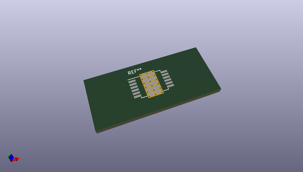
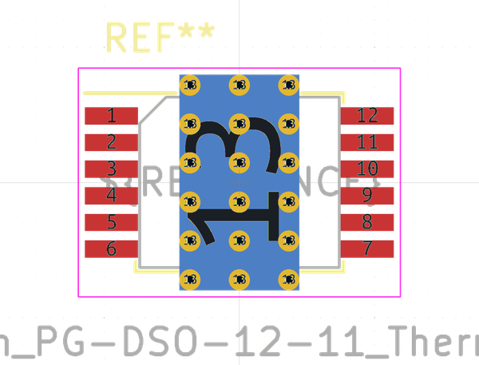
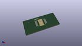

# OOMP Footprint  
## Infineon_PG-DSO-12-11_ThermalVias  by none  
  
oomp key: oomp_kicad_package_so_infineon_pg_dso_12_11_thermalvias  
  
source repo at: [http://gitlab.com/kicad/kicad-footprints/blob/master/tmp/data//oomlout_oomp_footprint_src/Varistor.pretty/RV_Rect_V25S440P_L26.5mm_W8.2mm_P12.7mm.kicad_mod](http://gitlab.com/kicad/kicad-footprints/blob/master/tmp/data//oomlout_oomp_footprint_src/Varistor.pretty/RV_Rect_V25S440P_L26.5mm_W8.2mm_P12.7mm.kicad_mod)  
## Footprint  
  
  
  
  
| name | value | 
| --- | --- | 
| footprint name | Infineon_PG-DSO-12-11_ThermalVias | 
| footprint description | Infineon PG-DSO 12 pin, exposed pad: 4.5x8.1mm, with thermal vias (https://www.infineon.com/cms/en/product/packages/PG-DSO/PG-DSO-12-11/) | 
| number of pads | 42 | 
| github path | http://github.com/kicad/kicad-footprints/blob/master/tmp/data//oomlout_oomp_footprint_src/Package_SO.pretty/Infineon_PG-DSO-12-11_ThermalVias.kicad_mod | 
| oomp key | oomp_kicad_package_so_infineon_pg_dso_12_11_thermalvias | 
| oomp bot github | https://github.com/oomlout/oomlout_oomp_footprint_bot/tree/main/tmp/data//oomlout_oomp_footprint_src/footprints/kicad_package_so_infineon_pg_dso_12_11_thermalvias/working | 
## Images  
  
  
  
  
  
  
  
  
