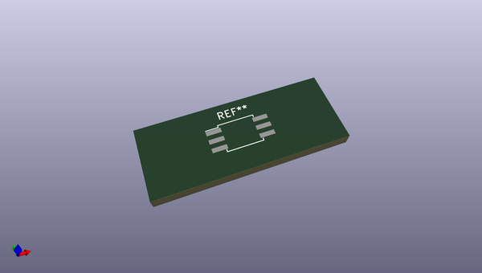
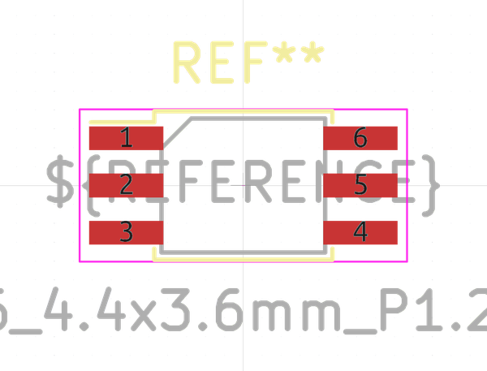
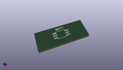
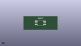

# OOMP Footprint  
## SO-6_4.4x3.6mm_P1.27mm  by none  
  
oomp key: oomp_kicad_package_so_so_6_4_4x3_6mm_p1_27mm  
  
source repo at: [http://gitlab.com/kicad/kicad-footprints/blob/master/tmp/data//oomlout_oomp_footprint_src/Varistor.pretty/RV_Rect_V25S440P_L26.5mm_W8.2mm_P12.7mm.kicad_mod](http://gitlab.com/kicad/kicad-footprints/blob/master/tmp/data//oomlout_oomp_footprint_src/Varistor.pretty/RV_Rect_V25S440P_L26.5mm_W8.2mm_P12.7mm.kicad_mod)  
## Footprint  
  
  
  
  
| name | value | 
| --- | --- | 
| footprint name | SO-6_4.4x3.6mm_P1.27mm | 
| footprint description | 6-Lead Plastic Small Outline (SO), see https://docs.broadcom.com/cs/Satellite?blobcol=urldata&blobheader=application%2Fpdf&blobheadername1=Content-Disposition&blobheadername2=Content-Type&blobheadername3=MDT-Type&blobheadervalue1=attachment%3Bfilename%3DIPD-Selection-Guide_AV00-0254EN_030617.pdf&blobheadervalue2=application%2Fx-download&blobheadervalue3=abinary%253B%2Bcharset%253DUTF-8&blobkey=id&blobnocache=true&blobtable=MungoBlobs&blobwhere=1430884105675&ssbinary=true | 
| number of pads | 6 | 
| github path | http://github.com/kicad/kicad-footprints/blob/master/tmp/data//oomlout_oomp_footprint_src/Package_SO.pretty/SO-6_4.4x3.6mm_P1.27mm.kicad_mod | 
| oomp key | oomp_kicad_package_so_so_6_4_4x3_6mm_p1_27mm | 
| oomp bot github | https://github.com/oomlout/oomlout_oomp_footprint_bot/tree/main/tmp/data//oomlout_oomp_footprint_src/footprints/kicad_package_so_so_6_4_4x3_6mm_p1_27mm/working | 
## Images  
  
  
  
  
  
  
  
  
