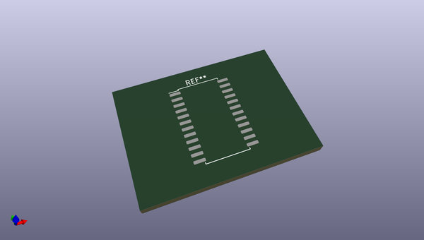
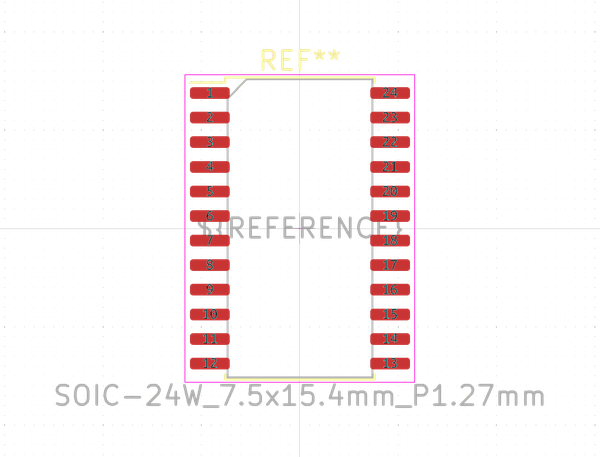
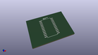
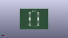

# OOMP Footprint  
## SOIC-24W_7.5x15.4mm_P1.27mm  by none  
  
oomp key: oomp_kicad_package_so_soic_24w_7_5x15_4mm_p1_27mm  
  
source repo at: [http://gitlab.com/kicad/kicad-footprints/blob/master/tmp/data//oomlout_oomp_footprint_src/Varistor.pretty/RV_Rect_V25S440P_L26.5mm_W8.2mm_P12.7mm.kicad_mod](http://gitlab.com/kicad/kicad-footprints/blob/master/tmp/data//oomlout_oomp_footprint_src/Varistor.pretty/RV_Rect_V25S440P_L26.5mm_W8.2mm_P12.7mm.kicad_mod)  
## Footprint  
  
  
  
  
| name | value | 
| --- | --- | 
| footprint name | SOIC-24W_7.5x15.4mm_P1.27mm | 
| footprint description | SOIC, 24 Pin (JEDEC MS-013AD, https://www.analog.com/media/en/package-pcb-resources/package/pkg_pdf/soic_wide-rw/RW_24.pdf), generated with kicad-footprint-generator ipc_gullwing_generator.py | 
| number of pads | 24 | 
| github path | http://github.com/kicad/kicad-footprints/blob/master/tmp/data//oomlout_oomp_footprint_src/Package_SO.pretty/SOIC-24W_7.5x15.4mm_P1.27mm.kicad_mod | 
| oomp key | oomp_kicad_package_so_soic_24w_7_5x15_4mm_p1_27mm | 
| oomp bot github | https://github.com/oomlout/oomlout_oomp_footprint_bot/tree/main/tmp/data//oomlout_oomp_footprint_src/footprints/kicad_package_so_soic_24w_7_5x15_4mm_p1_27mm/working | 
## Images  
  
  
  
  
  
  
  
  
