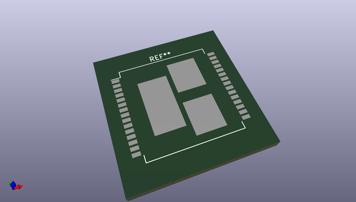
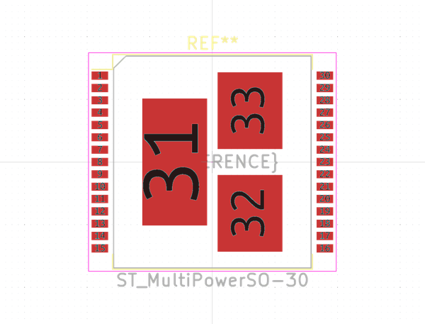
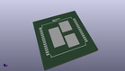
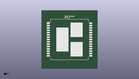

# OOMP Footprint  
## ST_MultiPowerSO-30  by none  
  
oomp key: oomp_kicad_package_so_st_multipowerso_30  
  
source repo at: [http://gitlab.com/kicad/kicad-footprints/blob/master/tmp/data//oomlout_oomp_footprint_src/Varistor.pretty/RV_Rect_V25S440P_L26.5mm_W8.2mm_P12.7mm.kicad_mod](http://gitlab.com/kicad/kicad-footprints/blob/master/tmp/data//oomlout_oomp_footprint_src/Varistor.pretty/RV_Rect_V25S440P_L26.5mm_W8.2mm_P12.7mm.kicad_mod)  
## Footprint  
  
  
  
  
| name | value | 
| --- | --- | 
| footprint name | ST_MultiPowerSO-30 | 
| footprint description | MultiPowerSO-30 3EP 16.0x17.2mm Pitch 1mm (http://www.st.com/resource/en/datasheet/vnh2sp30-e.pdf) | 
| number of pads | 33 | 
| github path | http://github.com/kicad/kicad-footprints/blob/master/tmp/data//oomlout_oomp_footprint_src/Package_SO.pretty/ST_MultiPowerSO-30.kicad_mod | 
| oomp key | oomp_kicad_package_so_st_multipowerso_30 | 
| oomp bot github | https://github.com/oomlout/oomlout_oomp_footprint_bot/tree/main/tmp/data//oomlout_oomp_footprint_src/footprints/kicad_package_so_st_multipowerso_30/working | 
## Images  
  
  
  
  
  
  
  
  
