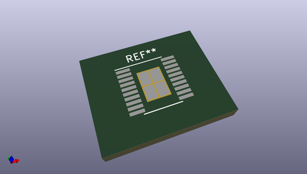
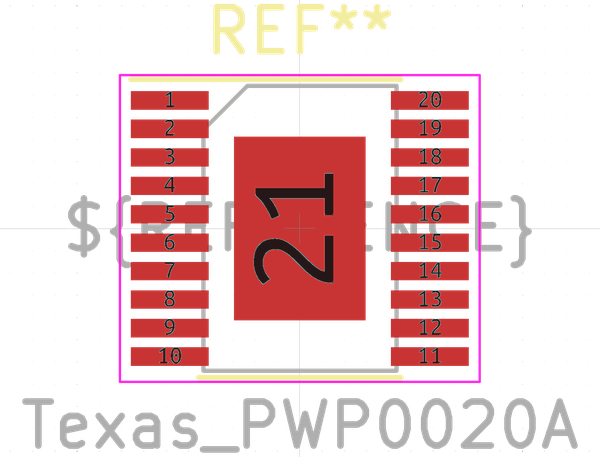
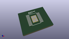
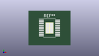

# OOMP Footprint  
## Texas_PWP0020A  by none  
  
oomp key: oomp_kicad_package_so_texas_pwp0020a  
  
source repo at: [http://gitlab.com/kicad/kicad-footprints/blob/master/tmp/data//oomlout_oomp_footprint_src/Varistor.pretty/RV_Rect_V25S440P_L26.5mm_W8.2mm_P12.7mm.kicad_mod](http://gitlab.com/kicad/kicad-footprints/blob/master/tmp/data//oomlout_oomp_footprint_src/Varistor.pretty/RV_Rect_V25S440P_L26.5mm_W8.2mm_P12.7mm.kicad_mod)  
## Footprint  
  
  
  
  
| name | value | 
| --- | --- | 
| footprint name | Texas_PWP0020A | 
| footprint description | 20-Pin Thermally Enhanced Thin Shrink Small-Outline Package, Body 4.4x6.5x1.1mm, Pad 3.0x4.2mm, Texas Instruments (see http://www.ti.com/lit/ds/symlink/lm5118.pdf) | 
| number of pads | 25 | 
| github path | http://github.com/kicad/kicad-footprints/blob/master/tmp/data//oomlout_oomp_footprint_src/Package_SO.pretty/Texas_PWP0020A.kicad_mod | 
| oomp key | oomp_kicad_package_so_texas_pwp0020a | 
| oomp bot github | https://github.com/oomlout/oomlout_oomp_footprint_bot/tree/main/tmp/data//oomlout_oomp_footprint_src/footprints/kicad_package_so_texas_pwp0020a/working | 
## Images  
  
  
  
  
  
  
  
  
