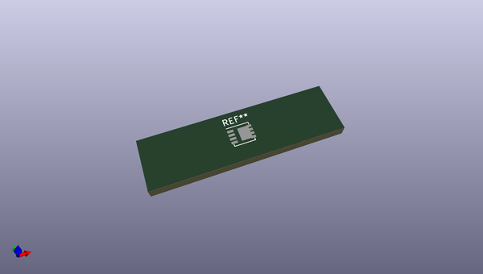
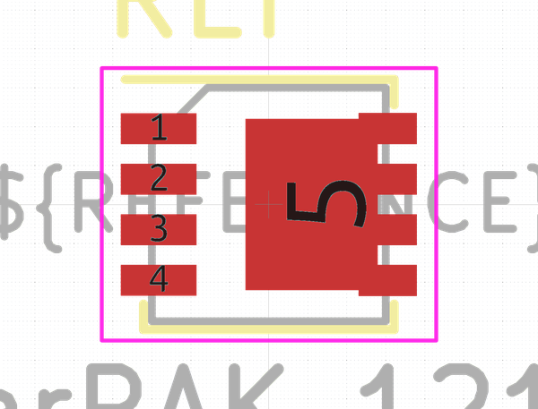

# OOMP Footprint  
## Vishay_PowerPAK_1212-8_Single  by none  
  
oomp key: oomp_kicad_package_so_vishay_powerpak_1212_8_single  
  
source repo at: [http://gitlab.com/kicad/kicad-footprints/blob/master/tmp/data//oomlout_oomp_footprint_src/Varistor.pretty/RV_Rect_V25S440P_L26.5mm_W8.2mm_P12.7mm.kicad_mod](http://gitlab.com/kicad/kicad-footprints/blob/master/tmp/data//oomlout_oomp_footprint_src/Varistor.pretty/RV_Rect_V25S440P_L26.5mm_W8.2mm_P12.7mm.kicad_mod)  
## Footprint  
  
  
  
  
| name | value | 
| --- | --- | 
| footprint name | Vishay_PowerPAK_1212-8_Single | 
| footprint description | PowerPAK 1212-8 Single (https://www.vishay.com/docs/71656/ppak12128.pdf, https://www.vishay.com/docs/72597/72597.pdf) | 
| number of pads | 5 | 
| github path | http://github.com/kicad/kicad-footprints/blob/master/tmp/data//oomlout_oomp_footprint_src/Package_SO.pretty/Vishay_PowerPAK_1212-8_Single.kicad_mod | 
| oomp key | oomp_kicad_package_so_vishay_powerpak_1212_8_single | 
| oomp bot github | https://github.com/oomlout/oomlout_oomp_footprint_bot/tree/main/tmp/data//oomlout_oomp_footprint_src/footprints/kicad_package_so_vishay_powerpak_1212_8_single/working | 
## Images  
  
  
  
  
  
  
  
  
