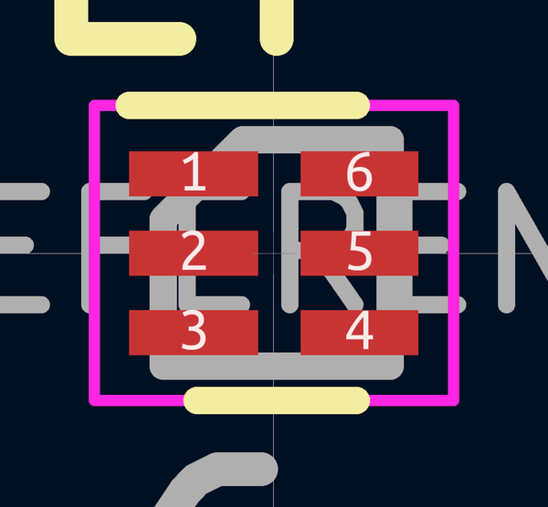
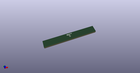

# OOMP Footprint  
## Fairchild_MicroPak2-6_1.0x1.0mm_P0.35mm  by none  
  
oomp key: oomp_kicad_package_son_fairchild_micropak2_6_1_0x1_0mm_p0_35mm  
  
source repo at: [http://gitlab.com/kicad/kicad-footprints/blob/master/tmp/data//oomlout_oomp_footprint_src/Varistor.pretty/RV_Rect_V25S440P_L26.5mm_W8.2mm_P12.7mm.kicad_mod](http://gitlab.com/kicad/kicad-footprints/blob/master/tmp/data//oomlout_oomp_footprint_src/Varistor.pretty/RV_Rect_V25S440P_L26.5mm_W8.2mm_P12.7mm.kicad_mod)  
## Footprint  
  
  
  
  
| name | value | 
| --- | --- | 
| footprint name | Fairchild_MicroPak2-6_1.0x1.0mm_P0.35mm | 
| footprint description | Fairchild-specific MicroPak2-6 1.0x1.0mm Pitch 0.35mm https://www.nxp.com/docs/en/application-note/AN10343.pdff | 
| number of pads | 6 | 
| github path | http://github.com/kicad/kicad-footprints/blob/master/tmp/data//oomlout_oomp_footprint_src/Package_SON.pretty/Fairchild_MicroPak2-6_1.0x1.0mm_P0.35mm.kicad_mod | 
| oomp key | oomp_kicad_package_son_fairchild_micropak2_6_1_0x1_0mm_p0_35mm | 
| oomp bot github | https://github.com/oomlout/oomlout_oomp_footprint_bot/tree/main/tmp/data//oomlout_oomp_footprint_src/footprints/kicad_package_son_fairchild_micropak2_6_1_0x1_0mm_p0_35mm/working | 
## Images  
  
  
  
  
  
  
  
  
