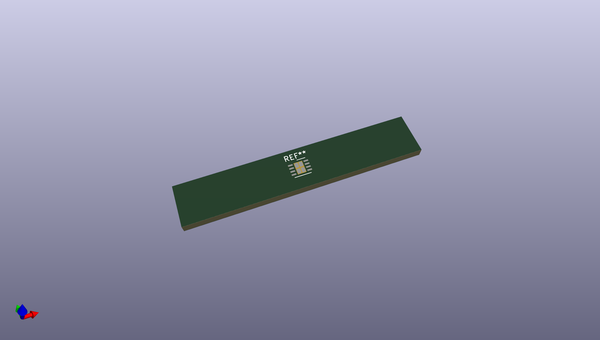
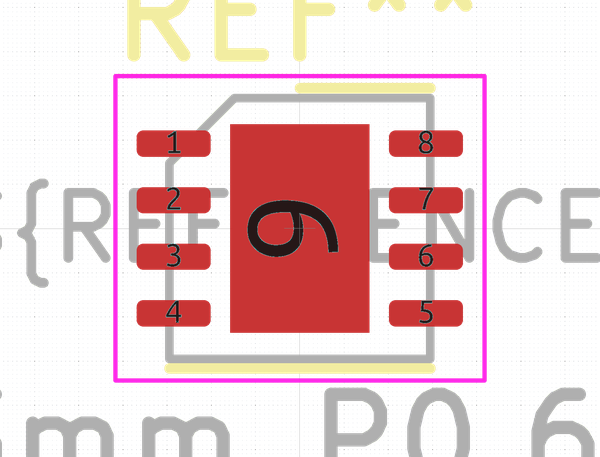
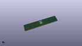

# OOMP Footprint  
## HVSON-8-1EP_3x3mm_P0.65mm_EP1.6x2.4mm  by none  
  
oomp key: oomp_kicad_package_son_hvson_8_1ep_3x3mm_p0_65mm_ep1_6x2_4mm  
  
source repo at: [http://gitlab.com/kicad/kicad-footprints/blob/master/tmp/data//oomlout_oomp_footprint_src/Varistor.pretty/RV_Rect_V25S440P_L26.5mm_W8.2mm_P12.7mm.kicad_mod](http://gitlab.com/kicad/kicad-footprints/blob/master/tmp/data//oomlout_oomp_footprint_src/Varistor.pretty/RV_Rect_V25S440P_L26.5mm_W8.2mm_P12.7mm.kicad_mod)  
## Footprint  
  
  
  
  
| name | value | 
| --- | --- | 
| footprint name | HVSON-8-1EP_3x3mm_P0.65mm_EP1.6x2.4mm | 
| footprint description | HVSON, 8 Pin (https://www.nxp.com/docs/en/data-sheet/TJA1051.pdf#page=16), generated with kicad-footprint-generator ipc_noLead_generator.py | 
| number of pads | 13 | 
| github path | http://github.com/kicad/kicad-footprints/blob/master/tmp/data//oomlout_oomp_footprint_src/Package_SON.pretty/HVSON-8-1EP_3x3mm_P0.65mm_EP1.6x2.4mm.kicad_mod | 
| oomp key | oomp_kicad_package_son_hvson_8_1ep_3x3mm_p0_65mm_ep1_6x2_4mm | 
| oomp bot github | https://github.com/oomlout/oomlout_oomp_footprint_bot/tree/main/tmp/data//oomlout_oomp_footprint_src/footprints/kicad_package_son_hvson_8_1ep_3x3mm_p0_65mm_ep1_6x2_4mm/working | 
## Images  
  
  
  
  
  
  
  
  
