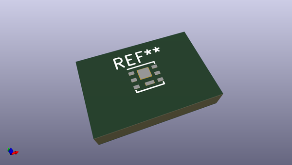
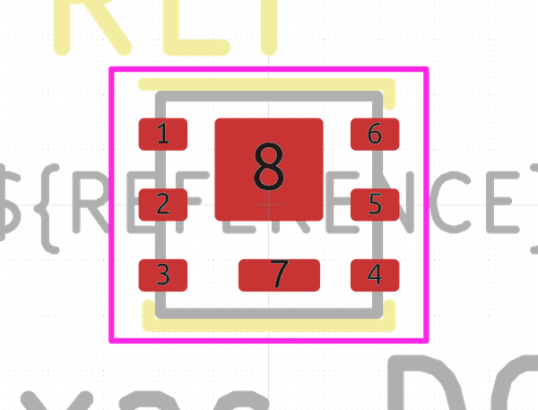
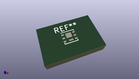

# OOMP Footprint  
## Texas_DQK  by none  
  
oomp key: oomp_kicad_package_son_texas_dqk  
  
source repo at: [http://gitlab.com/kicad/kicad-footprints/blob/master/tmp/data//oomlout_oomp_footprint_src/Varistor.pretty/RV_Rect_V25S440P_L26.5mm_W8.2mm_P12.7mm.kicad_mod](http://gitlab.com/kicad/kicad-footprints/blob/master/tmp/data//oomlout_oomp_footprint_src/Varistor.pretty/RV_Rect_V25S440P_L26.5mm_W8.2mm_P12.7mm.kicad_mod)  
## Footprint  
  
  
  
  
| name | value | 
| --- | --- | 
| footprint name | Texas_DQK | 
| footprint description | Texas WSON-6 DQK, http://www.ti.com/lit/ds/symlink/csd16301q2.pdf | 
| number of pads | 10 | 
| github path | http://github.com/kicad/kicad-footprints/blob/master/tmp/data//oomlout_oomp_footprint_src/Package_SON.pretty/Texas_DQK.kicad_mod | 
| oomp key | oomp_kicad_package_son_texas_dqk | 
| oomp bot github | https://github.com/oomlout/oomlout_oomp_footprint_bot/tree/main/tmp/data//oomlout_oomp_footprint_src/footprints/kicad_package_son_texas_dqk/working | 
## Images  
  
  
  
  
  
  
  
  
