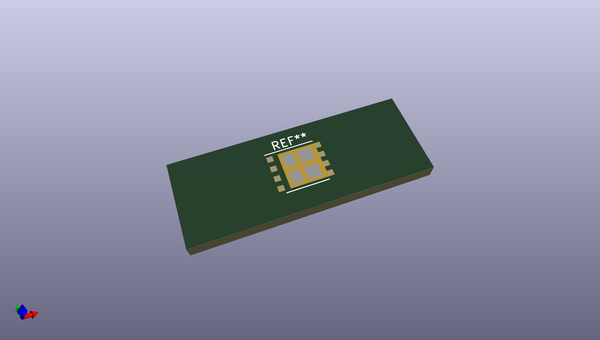
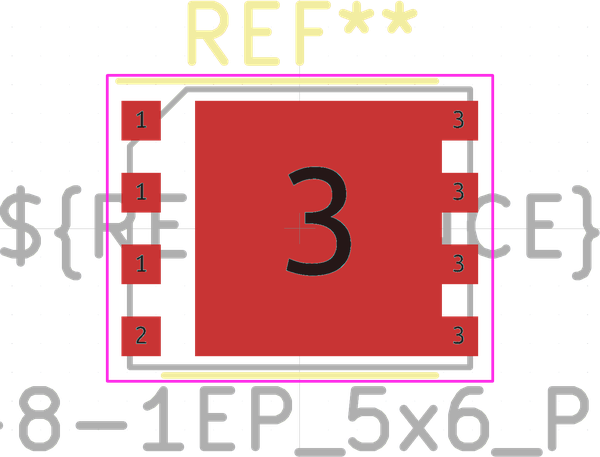
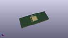

# OOMP Footprint  
## VSONP-8-1EP_5x6_P1.27mm  by none  
  
oomp key: oomp_kicad_package_son_vsonp_8_1ep_5x6_p1_27mm  
  
source repo at: [http://gitlab.com/kicad/kicad-footprints/blob/master/tmp/data//oomlout_oomp_footprint_src/Varistor.pretty/RV_Rect_V25S440P_L26.5mm_W8.2mm_P12.7mm.kicad_mod](http://gitlab.com/kicad/kicad-footprints/blob/master/tmp/data//oomlout_oomp_footprint_src/Varistor.pretty/RV_Rect_V25S440P_L26.5mm_W8.2mm_P12.7mm.kicad_mod)  
## Footprint  
  
  
  
  
| name | value | 
| --- | --- | 
| footprint name | VSONP-8-1EP_5x6_P1.27mm | 
| footprint description | SON, 8-Leads, Body 5x6x1mm, Pitch 1.27mm; (see Texas Instruments CSD18531Q5A http://www.ti.com/lit/ds/symlink/csd18531q5a.pdf) | 
| number of pads | 13 | 
| github path | http://github.com/kicad/kicad-footprints/blob/master/tmp/data//oomlout_oomp_footprint_src/Package_SON.pretty/VSONP-8-1EP_5x6_P1.27mm.kicad_mod | 
| oomp key | oomp_kicad_package_son_vsonp_8_1ep_5x6_p1_27mm | 
| oomp bot github | https://github.com/oomlout/oomlout_oomp_footprint_bot/tree/main/tmp/data//oomlout_oomp_footprint_src/footprints/kicad_package_son_vsonp_8_1ep_5x6_p1_27mm/working | 
## Images  
  
  
  
  
  
  
  
  
