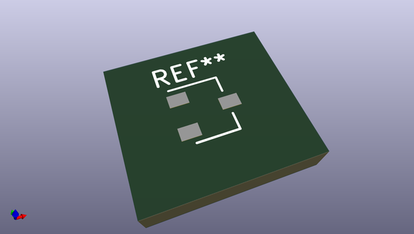
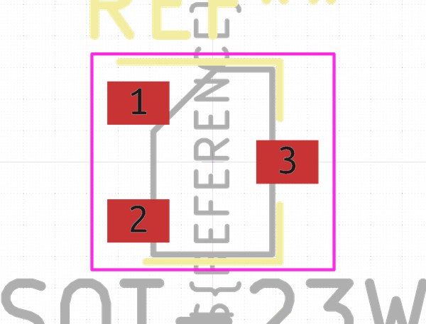
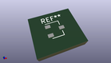

# OOMP Footprint  
## SOT-23W  by none  
  
oomp key: oomp_kicad_package_to_sot_smd_sot_23w  
  
source repo at: [http://gitlab.com/kicad/kicad-footprints/blob/master/tmp/data//oomlout_oomp_footprint_src/Varistor.pretty/RV_Rect_V25S440P_L26.5mm_W8.2mm_P12.7mm.kicad_mod](http://gitlab.com/kicad/kicad-footprints/blob/master/tmp/data//oomlout_oomp_footprint_src/Varistor.pretty/RV_Rect_V25S440P_L26.5mm_W8.2mm_P12.7mm.kicad_mod)  
## Footprint  
  
  
  
  
| name | value | 
| --- | --- | 
| footprint name | SOT-23W | 
| footprint description | SOT-23W http://www.allegromicro.com/~/media/Files/Datasheets/A112x-Datasheet.ashx?la=en&hash=7BC461E058CC246E0BAB62433B2F1ECA104CA9D3 | 
| number of pads | 3 | 
| github path | http://github.com/kicad/kicad-footprints/blob/master/tmp/data//oomlout_oomp_footprint_src/Package_TO_SOT_SMD.pretty/SOT-23W.kicad_mod | 
| oomp key | oomp_kicad_package_to_sot_smd_sot_23w | 
| oomp bot github | https://github.com/oomlout/oomlout_oomp_footprint_bot/tree/main/tmp/data//oomlout_oomp_footprint_src/footprints/kicad_package_to_sot_smd_sot_23w/working | 
## Images  
  
  
  
  
  
  
  
  
