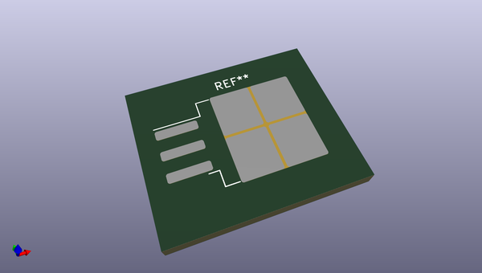
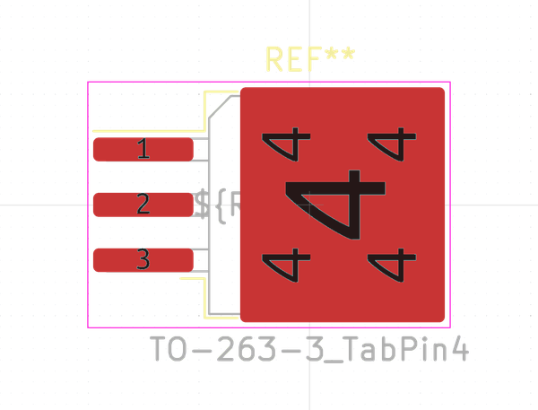
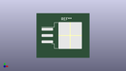

# OOMP Footprint  
## TO-263-3_TabPin4  by none  
  
oomp key: oomp_kicad_package_to_sot_smd_to_263_3_tabpin4  
  
source repo at: [http://gitlab.com/kicad/kicad-footprints/blob/master/tmp/data//oomlout_oomp_footprint_src/Varistor.pretty/RV_Rect_V25S440P_L26.5mm_W8.2mm_P12.7mm.kicad_mod](http://gitlab.com/kicad/kicad-footprints/blob/master/tmp/data//oomlout_oomp_footprint_src/Varistor.pretty/RV_Rect_V25S440P_L26.5mm_W8.2mm_P12.7mm.kicad_mod)  
## Footprint  
  
  
  
  
| name | value | 
| --- | --- | 
| footprint name | TO-263-3_TabPin4 | 
| footprint description | TO-263/D2PAK/DDPAK SMD package, http://www.infineon.com/cms/en/product/packages/PG-TO263/PG-TO263-3-1/ | 
| number of pads | 8 | 
| github path | http://github.com/kicad/kicad-footprints/blob/master/tmp/data//oomlout_oomp_footprint_src/Package_TO_SOT_SMD.pretty/TO-263-3_TabPin4.kicad_mod | 
| oomp key | oomp_kicad_package_to_sot_smd_to_263_3_tabpin4 | 
| oomp bot github | https://github.com/oomlout/oomlout_oomp_footprint_bot/tree/main/tmp/data//oomlout_oomp_footprint_src/footprints/kicad_package_to_sot_smd_to_263_3_tabpin4/working | 
## Images  
  
  
  
  
  
  
  
  
