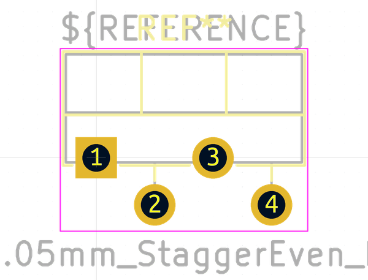

# OOMP Footprint  
## TO-220F-4_P5.08x2.05mm_StaggerEven_Lead1.85mm_Vertical  by none  
  
oomp key: oomp_kicad_package_to_sot_tht_to_220f_4_p5_08x2_05mm_staggereven_lead1_85mm_vertical  
  
source repo at: [http://gitlab.com/kicad/kicad-footprints/blob/master/tmp/data//oomlout_oomp_footprint_src/Varistor.pretty/RV_Rect_V25S440P_L26.5mm_W8.2mm_P12.7mm.kicad_mod](http://gitlab.com/kicad/kicad-footprints/blob/master/tmp/data//oomlout_oomp_footprint_src/Varistor.pretty/RV_Rect_V25S440P_L26.5mm_W8.2mm_P12.7mm.kicad_mod)  
## Footprint  
  
  
  
  
| name | value | 
| --- | --- | 
| footprint name | TO-220F-4_P5.08x2.05mm_StaggerEven_Lead1.85mm_Vertical | 
| footprint description | TO-220F-4, Vertical, RM 2.54mm, staggered type-2, see https://www.njr.com/semicon/PDF/package/TO-220F-4_E.pdf | 
| number of pads | 4 | 
| github path | http://github.com/kicad/kicad-footprints/blob/master/tmp/data//oomlout_oomp_footprint_src/Package_TO_SOT_THT.pretty/TO-220F-4_P5.08x2.05mm_StaggerEven_Lead1.85mm_Vertical.kicad_mod | 
| oomp key | oomp_kicad_package_to_sot_tht_to_220f_4_p5_08x2_05mm_staggereven_lead1_85mm_vertical | 
| oomp bot github | https://github.com/oomlout/oomlout_oomp_footprint_bot/tree/main/tmp/data//oomlout_oomp_footprint_src/footprints/kicad_package_to_sot_tht_to_220f_4_p5_08x2_05mm_staggereven_lead1_85mm_vertical/working | 
## Images  
  
  
  
  
