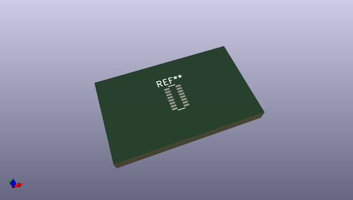
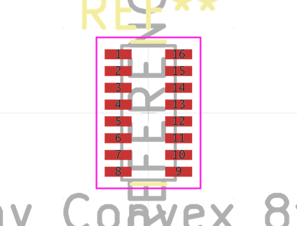
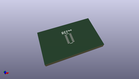
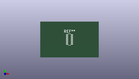

# OOMP Footprint  
## R_Array_Convex_8x0602  by none  
  
oomp key: oomp_kicad_resistor_smd_r_array_convex_8x0602  
  
source repo at: [http://gitlab.com/kicad/kicad-footprints/blob/master/tmp/data//oomlout_oomp_footprint_src/Varistor.pretty/RV_Rect_V25S440P_L26.5mm_W8.2mm_P12.7mm.kicad_mod](http://gitlab.com/kicad/kicad-footprints/blob/master/tmp/data//oomlout_oomp_footprint_src/Varistor.pretty/RV_Rect_V25S440P_L26.5mm_W8.2mm_P12.7mm.kicad_mod)  
## Footprint  
  
  
  
  
| name | value | 
| --- | --- | 
| footprint name | R_Array_Convex_8x0602 | 
| footprint description | Chip Resistor Network, ROHM MNR18 (see mnr_g.pdf) | 
| number of pads | 16 | 
| github path | http://github.com/kicad/kicad-footprints/blob/master/tmp/data//oomlout_oomp_footprint_src/Resistor_SMD.pretty/R_Array_Convex_8x0602.kicad_mod | 
| oomp key | oomp_kicad_resistor_smd_r_array_convex_8x0602 | 
| oomp bot github | https://github.com/oomlout/oomlout_oomp_footprint_bot/tree/main/tmp/data//oomlout_oomp_footprint_src/footprints/kicad_resistor_smd_r_array_convex_8x0602/working | 
## Images  
  
  
  
  
  
  
  
  
