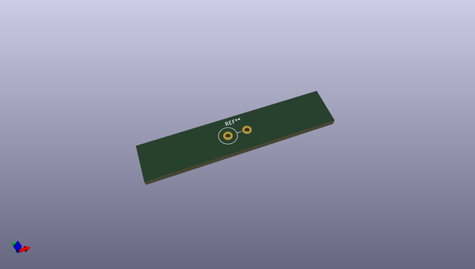
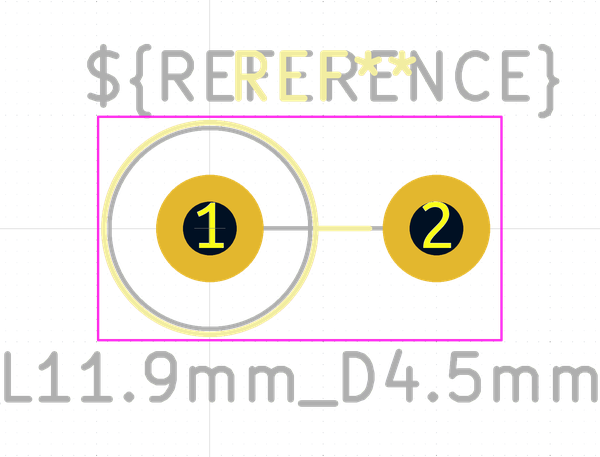
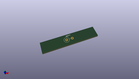

# OOMP Footprint  
## R_Axial_DIN0414_L11.9mm_D4.5mm_P5.08mm_Vertical  by none  
  
oomp key: oomp_kicad_resistor_tht_r_axial_din0414_l11_9mm_d4_5mm_p5_08mm_vertical  
  
source repo at: [http://gitlab.com/kicad/kicad-footprints/blob/master/tmp/data//oomlout_oomp_footprint_src/Varistor.pretty/RV_Rect_V25S440P_L26.5mm_W8.2mm_P12.7mm.kicad_mod](http://gitlab.com/kicad/kicad-footprints/blob/master/tmp/data//oomlout_oomp_footprint_src/Varistor.pretty/RV_Rect_V25S440P_L26.5mm_W8.2mm_P12.7mm.kicad_mod)  
## Footprint  
  
  
  
  
| name | value | 
| --- | --- | 
| footprint name | R_Axial_DIN0414_L11.9mm_D4.5mm_P5.08mm_Vertical | 
| footprint description | Resistor, Axial_DIN0414 series, Axial, Vertical, pin pitch=5.08mm, 2W, length*diameter=11.9*4.5mm^2, http://www.vishay.com/docs/20128/wkxwrx.pdf | 
| number of pads | 2 | 
| github path | http://github.com/kicad/kicad-footprints/blob/master/tmp/data//oomlout_oomp_footprint_src/Resistor_THT.pretty/R_Axial_DIN0414_L11.9mm_D4.5mm_P5.08mm_Vertical.kicad_mod | 
| oomp key | oomp_kicad_resistor_tht_r_axial_din0414_l11_9mm_d4_5mm_p5_08mm_vertical | 
| oomp bot github | https://github.com/oomlout/oomlout_oomp_footprint_bot/tree/main/tmp/data//oomlout_oomp_footprint_src/footprints/kicad_resistor_tht_r_axial_din0414_l11_9mm_d4_5mm_p5_08mm_vertical/working | 
## Images  
  
  
  
  
  
  
  
  
