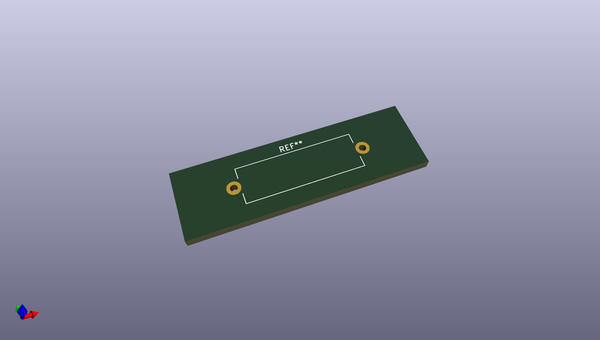
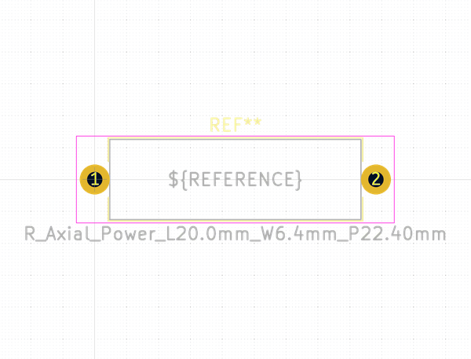
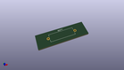
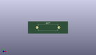

# OOMP Footprint  
## R_Axial_Power_L20.0mm_W6.4mm_P22.40mm  by none  
  
oomp key: oomp_kicad_resistor_tht_r_axial_power_l20_0mm_w6_4mm_p22_40mm  
  
source repo at: [http://gitlab.com/kicad/kicad-footprints/blob/master/tmp/data//oomlout_oomp_footprint_src/Varistor.pretty/RV_Rect_V25S440P_L26.5mm_W8.2mm_P12.7mm.kicad_mod](http://gitlab.com/kicad/kicad-footprints/blob/master/tmp/data//oomlout_oomp_footprint_src/Varistor.pretty/RV_Rect_V25S440P_L26.5mm_W8.2mm_P12.7mm.kicad_mod)  
## Footprint  
  
  
  
  
| name | value | 
| --- | --- | 
| footprint name | R_Axial_Power_L20.0mm_W6.4mm_P22.40mm | 
| footprint description | Resistor, Axial_Power series, Box, pin pitch=22.4mm, 4W, length*width*height=20*6.4*6.4mm^3, http://cdn-reichelt.de/documents/datenblatt/B400/5WAXIAL_9WAXIAL_11WAXIAL_17WAXIAL%23YAG.pdf | 
| number of pads | 2 | 
| github path | http://github.com/kicad/kicad-footprints/blob/master/tmp/data//oomlout_oomp_footprint_src/Resistor_THT.pretty/R_Axial_Power_L20.0mm_W6.4mm_P22.40mm.kicad_mod | 
| oomp key | oomp_kicad_resistor_tht_r_axial_power_l20_0mm_w6_4mm_p22_40mm | 
| oomp bot github | https://github.com/oomlout/oomlout_oomp_footprint_bot/tree/main/tmp/data//oomlout_oomp_footprint_src/footprints/kicad_resistor_tht_r_axial_power_l20_0mm_w6_4mm_p22_40mm/working | 
## Images  
  
  
  
  
  
  
  
  
