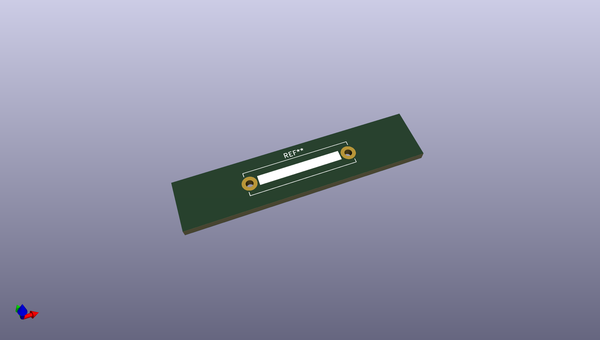
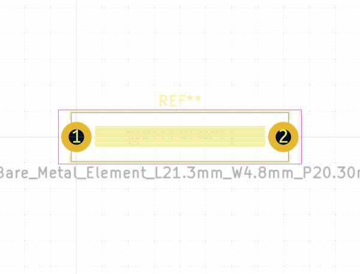
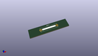
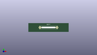

# OOMP Footprint  
## R_Bare_Metal_Element_L21.3mm_W4.8mm_P20.30mm  by none  
  
oomp key: oomp_kicad_resistor_tht_r_bare_metal_element_l21_3mm_w4_8mm_p20_30mm  
  
source repo at: [http://gitlab.com/kicad/kicad-footprints/blob/master/tmp/data//oomlout_oomp_footprint_src/Varistor.pretty/RV_Rect_V25S440P_L26.5mm_W8.2mm_P12.7mm.kicad_mod](http://gitlab.com/kicad/kicad-footprints/blob/master/tmp/data//oomlout_oomp_footprint_src/Varistor.pretty/RV_Rect_V25S440P_L26.5mm_W8.2mm_P12.7mm.kicad_mod)  
## Footprint  
  
  
  
  
| name | value | 
| --- | --- | 
| footprint name | R_Bare_Metal_Element_L21.3mm_W4.8mm_P20.30mm | 
| footprint description | Resistor, Bare_Metal_Element series, Bare Metal Strip/Wire, Horizontal, pin pitch=20.3mm, 5W, length*width=21.3*4.8mm^2, https://www.bourns.com/pdfs/PWR4412-2S.pdf | 
| number of pads | 2 | 
| github path | http://github.com/kicad/kicad-footprints/blob/master/tmp/data//oomlout_oomp_footprint_src/Resistor_THT.pretty/R_Bare_Metal_Element_L21.3mm_W4.8mm_P20.30mm.kicad_mod | 
| oomp key | oomp_kicad_resistor_tht_r_bare_metal_element_l21_3mm_w4_8mm_p20_30mm | 
| oomp bot github | https://github.com/oomlout/oomlout_oomp_footprint_bot/tree/main/tmp/data//oomlout_oomp_footprint_src/footprints/kicad_resistor_tht_r_bare_metal_element_l21_3mm_w4_8mm_p20_30mm/working | 
## Images  
  
  
  
  
  
  
  
  
