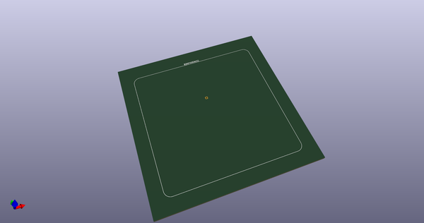
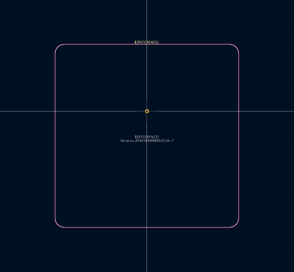
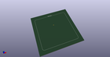

# OOMP Footprint  
## Abracon_APAES868R8060C16-T  by none  
  
oomp key: oomp_kicad_rf_antenna_abracon_apaes868r8060c16_t  
  
source repo at: [http://gitlab.com/kicad/kicad-footprints/blob/master/tmp/data//oomlout_oomp_footprint_src/Varistor.pretty/RV_Rect_V25S440P_L26.5mm_W8.2mm_P12.7mm.kicad_mod](http://gitlab.com/kicad/kicad-footprints/blob/master/tmp/data//oomlout_oomp_footprint_src/Varistor.pretty/RV_Rect_V25S440P_L26.5mm_W8.2mm_P12.7mm.kicad_mod)  
## Footprint  
  
  
  
  
| name | value | 
| --- | --- | 
| footprint name | Abracon_APAES868R8060C16-T | 
| footprint description | Abracon RHCP ceramic patch antenna 854-882Mhz, 5dBi | 
| number of pads | 1 | 
| github path | http://github.com/kicad/kicad-footprints/blob/master/tmp/data//oomlout_oomp_footprint_src/RF_Antenna.pretty/Abracon_APAES868R8060C16-T.kicad_mod | 
| oomp key | oomp_kicad_rf_antenna_abracon_apaes868r8060c16_t | 
| oomp bot github | https://github.com/oomlout/oomlout_oomp_footprint_bot/tree/main/tmp/data//oomlout_oomp_footprint_src/footprints/kicad_rf_antenna_abracon_apaes868r8060c16_t/working | 
## Images  
  
  
  
  
  
  
  
  
