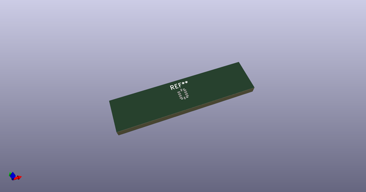
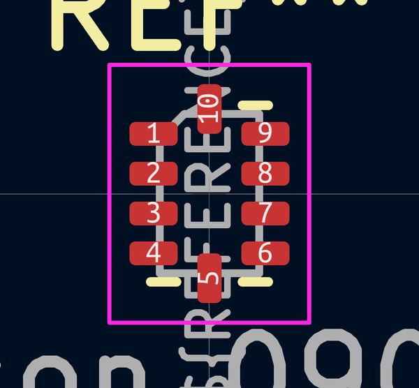
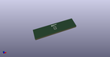

# OOMP Footprint  
## Balun_Johanson_0900FM15K0039  by none  
  
oomp key: oomp_kicad_rf_converter_balun_johanson_0900fm15k0039  
  
source repo at: [http://gitlab.com/kicad/kicad-footprints/blob/master/tmp/data//oomlout_oomp_footprint_src/Varistor.pretty/RV_Rect_V25S440P_L26.5mm_W8.2mm_P12.7mm.kicad_mod](http://gitlab.com/kicad/kicad-footprints/blob/master/tmp/data//oomlout_oomp_footprint_src/Varistor.pretty/RV_Rect_V25S440P_L26.5mm_W8.2mm_P12.7mm.kicad_mod)  
## Footprint  
  
  
  
  
| name | value | 
| --- | --- | 
| footprint name | Balun_Johanson_0900FM15K0039 | 
| footprint description | Johanson 0900FM15K0039 DFN, 10 Pin (https://www.johansontechnology.com/datasheets/0900FM15K0039/0900FM15K0039.pdf), generated with kicad-footprint-generator ipc_noLead_generator.py | 
| number of pads | 10 | 
| github path | http://github.com/kicad/kicad-footprints/blob/master/tmp/data//oomlout_oomp_footprint_src/RF_Converter.pretty/Balun_Johanson_0900FM15K0039.kicad_mod | 
| oomp key | oomp_kicad_rf_converter_balun_johanson_0900fm15k0039 | 
| oomp bot github | https://github.com/oomlout/oomlout_oomp_footprint_bot/tree/main/tmp/data//oomlout_oomp_footprint_src/footprints/kicad_rf_converter_balun_johanson_0900fm15k0039/working | 
## Images  
  
  
  
  
  
  
