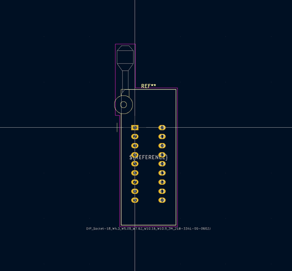
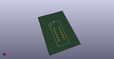
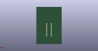
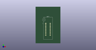

# OOMP Footprint  
## DIP_Socket-18_W4.3_W5.08_W7.62_W10.16_W10.9_3M_218-3341-00-0602J  by none  
  
oomp key: oomp_kicad_socket_dip_socket_18_w4_3_w5_08_w7_62_w10_16_w10_9_3m_218_3341_00_0602j  
  
source repo at: [http://gitlab.com/kicad/kicad-footprints/blob/master/tmp/data//oomlout_oomp_footprint_src/Varistor.pretty/RV_Rect_V25S440P_L26.5mm_W8.2mm_P12.7mm.kicad_mod](http://gitlab.com/kicad/kicad-footprints/blob/master/tmp/data//oomlout_oomp_footprint_src/Varistor.pretty/RV_Rect_V25S440P_L26.5mm_W8.2mm_P12.7mm.kicad_mod)  
## Footprint  
  
  
  
  
| name | value | 
| --- | --- | 
| footprint name | DIP_Socket-18_W4.3_W5.08_W7.62_W10.16_W10.9_3M_218-3341-00-0602J | 
| footprint description | 3M 18-pin zero insertion force socket, through-hole, row spacing 7.62 mm (300 mils), http://multimedia.3m.com/mws/media/494546O/3mtm-dip-sockets-100-2-54-mm-ts0365.pdf | 
| number of pads | 18 | 
| github path | http://github.com/kicad/kicad-footprints/blob/master/tmp/data//oomlout_oomp_footprint_src/Socket.pretty/DIP_Socket-18_W4.3_W5.08_W7.62_W10.16_W10.9_3M_218-3341-00-0602J.kicad_mod | 
| oomp key | oomp_kicad_socket_dip_socket_18_w4_3_w5_08_w7_62_w10_16_w10_9_3m_218_3341_00_0602j | 
| oomp bot github | https://github.com/oomlout/oomlout_oomp_footprint_bot/tree/main/tmp/data//oomlout_oomp_footprint_src/footprints/kicad_socket_dip_socket_18_w4_3_w5_08_w7_62_w10_16_w10_9_3m_218_3341_00_0602j/working | 
## Images  
  
  
  
  
  
  
